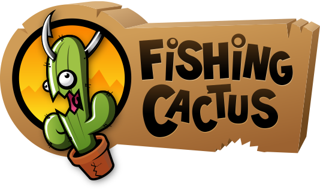

# Fishing Cactus

Address: Avenue Guibal et Devillez, 1 - 7000 Mons

Phone: +32.652.258.86

Links:
[Website](http://www.fishingcactus.com/)
[Discord](https://discordapp.com/invite/KqtBnHM)
[Facebook](https://www.facebook.com/fishingcactus)
[LinkedIn](https://www.linkedin.com/company/fishing-cactus)
[Twitter](https://twitter.com/FishingCactus)
[Youtube](https://www.youtube.com/user/FishingCactusGames)

## Pitch

**4 mots**: Hey - Mon - Ami - Patates
**Phrase**: ...

## Founder(s)

- [Prénom NOM](#LinkedIn) (Communication)
- ...

## Lead Developer(s)

- [Ramses Ladlani ](https://www.linkedin.com/in/ramses) (Senior)
- [Maxime Rollet](https://www.linkedin.com/in/maxime-rollet-76259b3) (Medior)
- ...
- [Laurent Grumiaux](https://www.linkedin.com/in/grumiauxl) (Buisness)

## Company Info

Fishing Cactus is a video game development studio based in Mons (Digital Innovation Valley), Belgium. The company  was established by four games industry veterans in 2008 and now employing more than 20 developers. We do work for hire and original IP development.

Fishing Cactus creates high quality titles that are standing out in the AA budget space. Our games feature innovative mechanics and smart art choices which prevent the upscaling of development budgets. Our motto is Smart Games with Soul.

- 11-50 employees
- 0-2 dévelopeurs

## Custumer Segment

### Client cible

- Description
- Pourquoi ?

Client cible (3 point)

5 points: Tout les informations ont été trouvées
0-5 points: Vous pensez pouvoir travail dans l'entreprise et savez me justifier pourquoi. (0-5 en fonction de la réponse)
